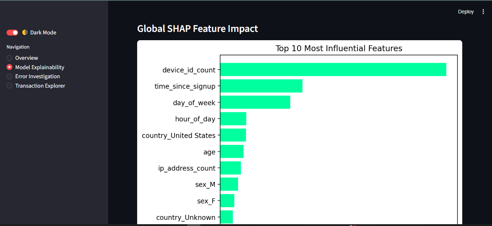
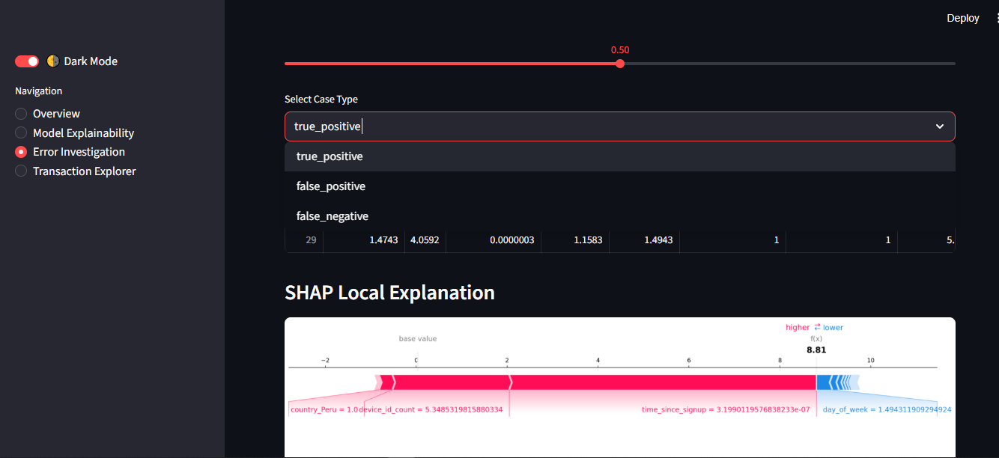
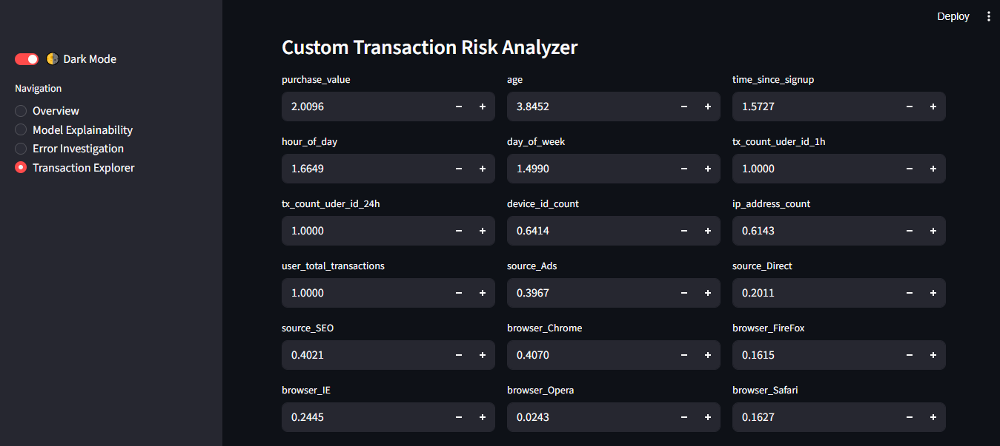
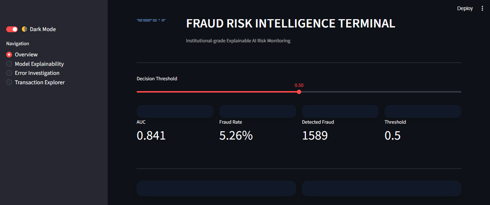
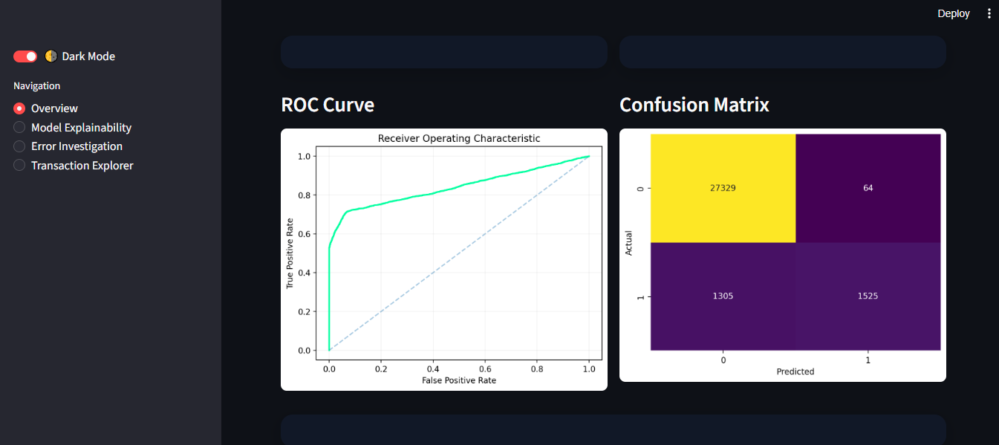

# Fraud Detection System for Financial & E-commerce Transactions


An end-to-end, production-ready **fraud detection platform** designed to identify suspicious transactions in real time.
The system transforms raw transactional and behavioral data into fraud signals, trains and tracks machine learning models, and exposes predictions through a scalable API.

---

## Table of Contents

- [Project Overview](#project-overview)
- [Business Context](#business-context)
- [Fraud Detection Business Understanding](#fraud-detection-business-understanding)
- [Objectives](#objectives)
- [Dataset Overview](#dataset-overview)
- [Project Structure](#project-structure)
- [Architecture](#architecture)
- [Modeling Approach](#modeling-approach)
- [MLOps & Engineering Practices](#mlops--engineering-practices)
- [Setup & Installation](#setup--installation)
- [Running the Project](#running-the-project)
- [API Usage](#api-usage)
- [Technologies Used](#technologies-used)
- [Author](#author)

---

## Project Overview

This project implements a **Fraud Detection System** for financial and e-commerce transactions.
It is designed to detect fraudulent behavior in environments where transaction volume is high, patterns evolve quickly, and false positives are costly.

The system covers the full lifecycle:

- Data ingestion and cleaning
- Feature engineering (temporal, behavioral, transactional, geolocation)
- Class imbalance handling (SMOTE / undersampling)
- Model training, tuning, and evaluation
- Explainability with SHAP and feature importance
- Experiment tracking and reproducibility
- Real-time fraud prediction via FastAPI
- Containerized deployment using Docker

---

## Business Context

Financial institutions and e-commerce platforms face continuous losses due to fraudulent transactions.
Fraud patterns change rapidly, making rule-based systems brittle and hard to maintain.

This project supports:

- **Real-time fraud screening**
- **Risk-based transaction approval**
- **Fraud monitoring and investigation**
- **Reduction of false positives**

The output is a **fraud probability score** that can be integrated into transaction decision pipelines.

---

## Fraud Detection Business Understanding

### Nature of Fraud Problems

Fraud detection differs from traditional classification tasks:

- Fraud cases are **rare** (high class imbalance)
- Fraud patterns **evolve over time**
- False positives directly impact customer experience
- Explainability is required for investigations and audits

This system is designed with these constraints in mind.

### Class Imbalance Strategy

Fraud labels are highly imbalanced.
To address this, the project supports:

- SMOTE and controlled oversampling
- Undersampling of majority class
- Threshold tuning based on business cost
- Precision-Recall focused evaluation (AUC-PR, F1)

### Model Interpretability

Fraud predictions must be explainable for:

- Internal fraud analysts
- Customer dispute resolution
- Regulatory and audit requirements

This project integrates:

- SHAP value analysis
- Global and local feature importance
- Human-readable explainability reports

---

## Objectives

- Detect fraudulent transactions accurately
- Engineer robust fraud-specific features
- Handle extreme class imbalance safely
- Compare interpretable and complex models
- Explain model predictions
- Serve predictions through a scalable API
- Ensure reproducibility and auditability

---

## Dataset Overview

**Sources:**

- E-commerce transaction logs
- Banking / credit card transaction datasets
- IP geolocation reference data

**Key fields include:**

| Column               | Description                        |
| -------------------- | ---------------------------------- |
| TransactionId        | Unique transaction identifier      |
| CustomerId           | Unique customer identifier         |
| Amount               | Transaction amount                 |
| ChannelId            | Platform channel                   |
| TransactionStartTime | Timestamp                          |
| IPAddress            | Client IP address                  |
| FraudResult          | Fraud label (0 = legit, 1 = fraud) |

Derived features include:

- Time-based signals
- Velocity and frequency features
- Amount-based aggregations
- Country and geolocation risk indicators

---

## Project Structure

````text
fraud-detection/
│
├── config/                          # YAML configuration files for system behavior and experiments
│
├── data/                             # Storage for all dataset versions
│   ├── raw/                          # Original datasets (never modified)
│   ├── interim/                      # Cleaned but not fully transformed data
│   ├── processed/                    # Final model-ready datasets for training and inference
│
├── notebooks/                        # Jupyter notebooks for EDA, feature engineering, modeling
│
├── src/
│   └── fraud_detection/               # Main Python package
│       ├── __init__.py                # Marks fraud_detection as a package
│
│       ├── analysis/                  # Exploratory data analysis tools
│
│       ├── core/                      # Global core functionality and configuration
│
│       ├── data/                      # Data ingestion and preprocessing
│
│       ├── explainability/            # Model explainability and interpretation
│
│       ├── features/                  # Feature engineering modules
│
│       ├── models/                    # Model training, evaluation, and persistence
│
│       ├── utils/                      # Shared helper functions
│
│       └── viz/                        # Visualization utilities
│
├── tests/                                # Automated testing
│
│
├── scripts/                              # CLI & automation entry points
│
├── mlruns/                               # MLflow experiment tracking
├── dvc.yaml                              # DVC pipeline definition
├── params.yaml                           # Global experiment parameters
├── requirements.txt                     # Runtime dependencies
├── pyproject.toml                       # Build & packaging configuration
└── README.md                            # Project overview & usage


## Architecture
```textRaw Data
   ↓
Data Loading & Validation
   ↓
IP Geolocation Enrichment
   ↓
Feature Engineering Pipeline
   ↓
Model Training & Hyperparameter Tuning
   ↓
Experiment Tracking (MLflow)
   ↓
Explainability (SHAP + Feature Importance)
   ↓
FastAPI Inference Layer
   ↓
Streamlit Risk Dashboard

````

## Setup & Installation

Clone the repository:

```bash
git clone https://github.com/<useraname>/fraud_detection.git
cd fraud_detection
```

### Create and activate a virtual environment:

```bash
python -m venv .venv
source .venv/bin/activate
```

Install dependencies:

- pyproject run

```bash

pip install -r requirements.txt
```

- pyproject run

```bash

pip install -e .
```

## Running the Project

### Run the full pipeline (DVC)

```bash
dvc repro
```

### Run Dashboard

```bash
streamlit run dashboard/app.py
```

#### Dashboard Demo 







## Author

Tibebu Kaleb | ML/AI Engineer

## 🌐 Connect

[](https://tibebukaleb.netlify.app)
[](mailto:wise.tibec@gmail.com)
[](https://www.linkedin.com/in/tibeb)
[](https://instagram.com/wise.tibec)
